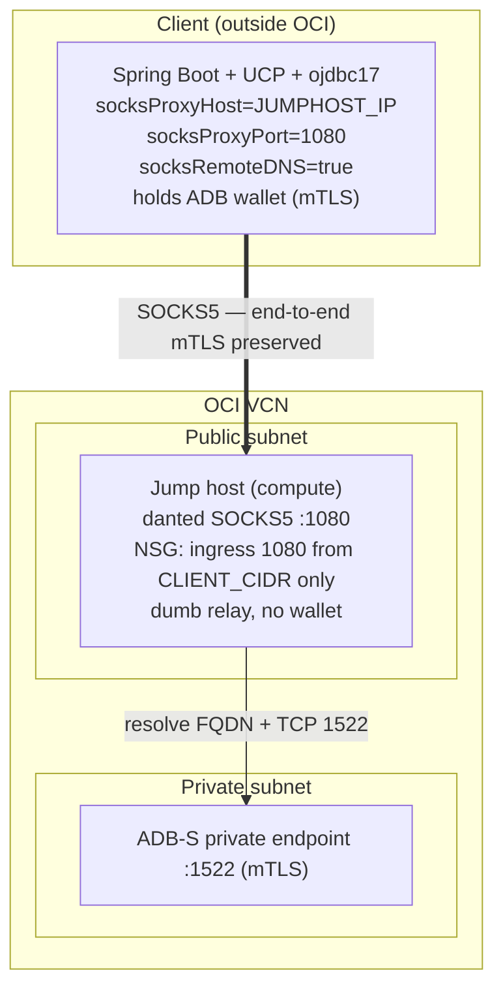

# Oracle JDBC over SOCKS5 — PoC

Proves that a Java client (Spring Boot + UCP + ojdbc17) can reach a **private Oracle Autonomous Database (ADB-S, mTLS)** through a **SOCKS5 proxy**, with the proxy acting as a dumb relay that never holds a wallet or decrypts traffic.

The proxy is a transparent TCP relay. mTLS is between the Java client and ADB — the jump host sees only ciphertext and the destination address.

---

## Topology



---

## Decisions

| Area                               | Choice                                                                     | Why / when to use something else                                                                                                                                                                                                            |
| ---------------------------------- | -------------------------------------------------------------------------- | ------------------------------------------------------------------------------------------------------------------------------------------------------------------------------------------------------------------------------------------- |
| **DB**                             | ADB-S 26ai, private endpoint, mTLS wallet                                  | Exercises wallet + private DNS + mTLS end-to-end. Toggle `auth_mode=tls` for the walletless path (§ Auth mode).                                                                                                                             |
| **Connectivity (primary)**         | Self-managed jump host running danted (SOCKS5 daemon)                      | Always-on; no TTL; faithfully models a SOCKS5 proxy owned by the DB team.                                                                                                                                                                   |
| **Connectivity (demo)**            | OCI Bastion dynamic port-forwarding (SOCKS5)                               | Zero infra, free, IAM-controlled. 3-hour hard TTL — demo and ad-hoc access only.                                                                                                                                                            |
| **Connectivity (alt, documented)** | CMAN-TDM                                                                   | Oracle-native chokepoint with per-service rules. Use when the requirement is "controlled chokepoint, no VPN" rather than literal SOCKS5. CMAN terminates Oracle Net and holds a wallet — does not satisfy "proxy must not decrypt traffic." |
| **DNS**                            | `oracle.net.socksRemoteDNS=true`                                           | ADB private FQDN resolves only inside the VCN; the jump host does the lookup. `false` → `host not found`.                                                                                                                                   |
| **JDBC stack**                     | ojdbc17 / ucp17 / oraclepki **23.8.0.25.04**, JDK 21 LTS                   | Native `oracle.net.socks*` properties are connection-scoped, not JVM-wide. JDK 21 is the certified sweet spot for this driver version.                                                                                                      |
| **SOCKS auth**                     | No SOCKS-layer auth (mode B); NSG source-IP allowlist + end-to-end mTLS    | The native NIO SOCKS client advertises only no-auth (`0x00`). Security is enforced at the DB and TLS layers, not at the relay.                                                                                                              |
| **Proxy trust model**              | Dumb relay — jump host holds no wallet, sees only ciphertext + destination | Minimizes what the chokepoint can access; mTLS stays client↔ADB.                                                                                                                                                                            |
| **App**                            | Spring Boot 4.1, Java 21, virtual threads on                               | Current GA (Spring Framework 7 / Jakarta EE 11 / Tomcat 11). UCP integrates wallet + connection validation.                                                                                                                                 |
| **Network security**               | NSG source-IP allowlist                                                    | ZPR (Zero Trust Packet Routing) is intentionally out of scope for this PoC; NSG source-IP is the network control.                                                                                                                           |
| **Config mgmt**                    | Ansible role for the jump host                                             | Repeatable SOCKS daemon install + hardening against a real compute host.                                                                                                                                                                    |

---

## Connectivity comparison

|                                        | Jump host SOCKS5            | OCI Bastion SOCKS5   | CMAN-TDM                          |
| -------------------------------------- | --------------------------- | -------------------- | --------------------------------- |
| Always-on                              | **Yes**                     | No (≤ 3 h TTL)       | Yes                               |
| You patch/own the host                 | Yes                         | No (managed)         | Yes                               |
| Proxy sees plaintext / holds DB creds  | **No** (dumb relay)         | No (dumb relay)      | **Yes** (terminates + wallet)     |
| Satisfies literal "SOCKS5" requirement | **Yes**                     | Yes                  | **No**                            |
| Rule granularity                       | NSG + IP                    | IAM + CIDR           | Per-service Oracle Net rules      |
| Best for                               | Production always-on SOCKS5 | Demo / ad-hoc access | "Chokepoint, not VPN" requirement |

---

## Quickstart

Full step-by-step instructions are in **[DEPLOY.md](DEPLOY.md)**. The demo narrative is in **[DEMO.md](DEMO.md)**.

### Command flow

Run these one at a time. Each step builds on the previous one.

Create the Python virtual environment. This is a one-time step that must run before any `manage.py` call.

```bash
python3 -m venv .venv
```

Install the orchestrator and its dependencies into the virtual environment.

```bash
.venv/bin/pip install -e .
```

Configure the project. This is interactive: it reads your `~/.oci/config`, lets you pick the OCI profile, region, and compartment from lists, auto-detects your public IP for the jump host allowlist, picks your SSH key, and generates the database password. It writes `.env` and `infra/terraform/terraform.tfvars` for you — nothing to edit by hand. The only prerequisite is a working OCI CLI config (`oci setup config`).

```bash
.venv/bin/python manage.py setup
```

Provision the infrastructure: the VCN, the private ADB-S, and the public jump host.

```bash
.venv/bin/python manage.py tf apply
```

Install and harden the danted SOCKS5 daemon on the jump host.

```bash
.venv/bin/python manage.py provision
```

Download a fresh wallet into `wallet/`.

```bash
.venv/bin/python manage.py wallet fetch
```

Build the Spring Boot jar. This runs `./gradlew bootJar` and produces `app/build/libs/socks5poc-*.jar`.

```bash
.venv/bin/python manage.py build
```

Start the app.

```bash
.venv/bin/python manage.py run
```

Confirm DB connectivity through the proxy. A healthy response is `{"status":"UP"}` with the DB sub-check, latency, pool stats, and the socks host:port.

```bash
.venv/bin/python manage.py health
```

---

## Auth mode

`setup` asks which auth mode to use and records it in `.env` (`AUTH_MODE`) and `terraform.tfvars`:

| `AUTH_MODE`      | What changes                                                                                                                                          |
| ---------------- | ----------------------------------------------------------------------------------------------------------------------------------------------------- |
| `mtls` (default) | Wallet required. Set `WALLET_PATH`. `TNS_ADMIN` points at the wallet directory. Port 1522.                                                            |
| `tls`            | Walletless. No wallet download, no `TNS_ADMIN`, no cert-expiry risk. Use the TLS connect string from the ADB console. SOCKS properties are unchanged. |

The SOCKS path (`oracle.net.socksProxyHost/Port/RemoteDNS`) is identical for both modes; only wallet handling differs. `tls` is Oracle's recommended mode for private-endpoint / ACL-restricted ADB in production.

---

## Anti-patterns

**❌ Legacy JVM SOCKS (`socksProxyHost` + `javaNetNio=false`)**
Using JVM system properties `java.net.socks.*` with `oracle.jdbc.javaNetNio=false` disables non-blocking I/O driver-wide. This is a global, performance-degrading setting that broke in driver versions 12.2–18c. Use the connection-scoped `oracle.net.socks*` properties instead.

**❌ Missing `oracle.net.socksRemoteDNS=true`**
The ADB private FQDN is not resolvable outside the VCN. Without this property, the client attempts to resolve the FQDN locally, gets `host not found`, and the connection fails. The demo includes a negative test that reproduces this failure.

**❌ Treating OCI Bastion as always-on**
OCI Bastion sessions have a hard 3-hour TTL (maximum, not raisable). Any reconnect loop that re-creates sessions before expiry has a gap window and is not suitable for a production data plane.

**❌ Reusing a pre-2026 wallet (DigiCert G1)**
Wallets generated before 28 Jan 2026 carry DigiCert G1 roots, which stop working after 15 Apr 2026. Current wallets use G2. `manage.py wallet fetch` always pulls a fresh wallet — never reuse stale wallet material.

---

## Cost & teardown

- **ADB-S:** smallest ECPU count, autoscale off. Stop between sessions; `tf destroy` removes it completely.
- **Jump host:** smallest Flex or A1 shape. Stoppable when not in use.
- **OCI Bastion:** free; sessions are ephemeral.

Stop the app and clear the local `wallet/` contents.

```bash
.venv/bin/python manage.py clean
```

Tear down all OCI resources.

```bash
.venv/bin/python manage.py tf destroy
```
